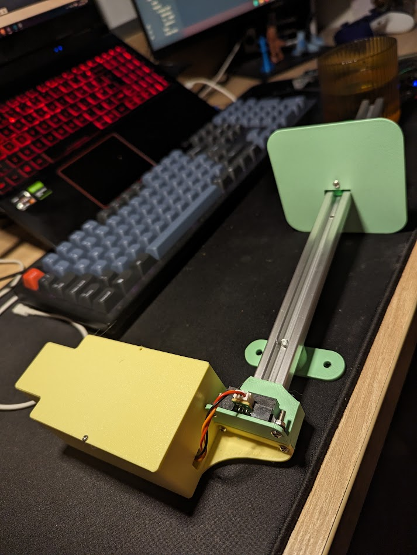

# Flood-Monitoring-IoT
Checking local flooding of footpaths and cycleways is easy with this IoT-enabled water level monitor that posts to a handy web app.

[Hackster.io project](https://www.hackster.io/Meadeor/infrastructure-flood-monitoring-for-all-d776bc) 